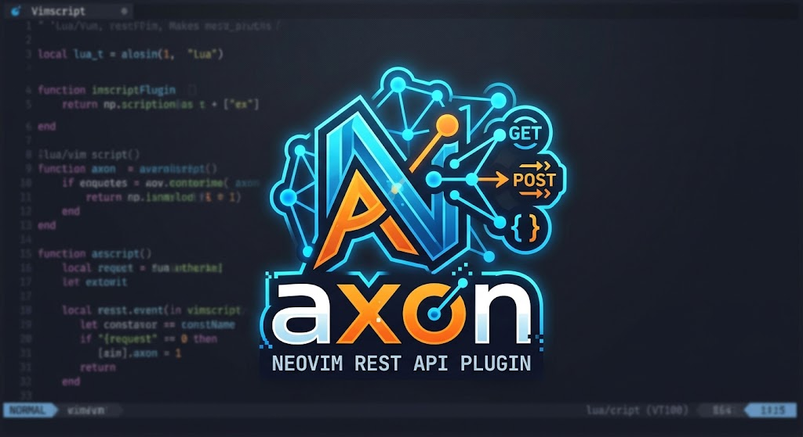

<p align="center">
  
</p>

# axon.nvim

Run requests from `.http` files in Neovim using [axon-cli](https://github.com/desdic/axon-cli).

## Requirements

- Neovim 0.12+
- `axon-cli` on `$PATH`, or set with `cmd`
- `jq` (optional), which pretty-prints JSON bodies without changing key order

Run `:checkhealth axon` to check all of these.

## Defaults

```lua
require("axon").setup({
  cmd = "axon-cli",           -- or an absolute path to axon-cli
  args = {},                  -- arguments for axon-cli
  split = "botright vsplit",  -- command to split window
  format_json = true,         -- format json
  jq = "jq",                  -- jq for formatting
  keymaps = { toggle_headers = "H", rerun = "R", close = "q", open = "<CR>", back = "<BS>" }, -- false disables
})
```
## Setup

Example of lazy loading with Neovims vim.pack

```lua
vim.pack.add({
    { src = "https://github.com/desdic/axon.nvim", load = false },
}, { confirm = false })

vim.api.nvim_create_autocmd("FileType", {
    pattern = "http",
    callback = function(event)
        if not vim.g.axon_nvim_loaded then
            require("axon").setup({})
            vim.g.axon_nvim_loaded = true
        end

        local opts = { buffer = event.buf, remap = false }

        opts.desc = "Axon run request"
        vim.keymap.set("n", "<leader>As", "<cmd>AxonRun<cr>", opts)

        opts.desc = "Axon run all requests"
        vim.keymap.set("n", "<leader>Aa", "<cmd>AxonRunAll<cr>", opts)

        opts.desc = "Axon pick request"
        vim.keymap.set("n", "<leader>Ap", "<cmd>AxonPick<cr>", opts)

        opts.desc = "Axon toggle headers"
        vim.keymap.set("n", "<leader>At", "<cmd>AxonToggleHeaders<cr>", opts)

        opts.desc = "Axon rerun request"
        vim.keymap.set("n", "<leader>Ar", "<cmd>AxonRerun<cr>", opts)
    end,
})

```

## Commands

| Command | Description |
|---|---|
| `:AxonRun` | Run the request under the cursor |
| `:AxonRunAll` | Run every request in the buffer, in order, in one axon-cli call so cookies carry over |
| `:AxonPick` | Pick a request in the buffer from a list (`vim.ui.select`) and run it |
| `:AxonRerun` | Run the last request (or all of them, after `:AxonRunAll`) again, picking up any edits |
| `:AxonToggleHeaders` | Switch the response between body and status line + headers |
